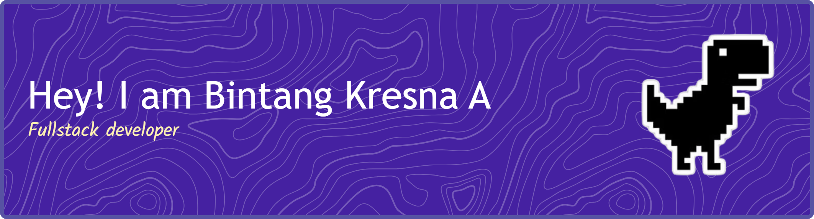

## Welcome to my GitHub 👋

---

I'm a **Information Systems graduate and Full Stack Developer** with a strong interest in building modern, scalable, and maintainable web applications.

My development journey focuses on **frontend and backend development**, with hands-on experience using **Laravel, React, Next.js, Vue.js, MySQL, and RESTful APIs**. I enjoy turning business requirements into practical digital solutions while continuously improving code quality, performance, and user experience.

I’m always learning, building, and exploring new technologies to become a better software developer.

 

## 👨‍💻 About Me

<table>
<tr>
<td width="50%" valign="top">

### 🏆 Experience & Journey

* 🎓 Bachelor's Degree in **Information Systems** from Universitas Amikom Yogyakarta
* 💼 Currently working as a **Laravel Programmer / Full Stack Developer** at PT Javas Teknologi Integrator
* 🚀 Previously worked as a **Full Stack Web Developer Intern** at PT GIT Solution
* 💻 Experienced in developing web applications using **Laravel, React, Next.js, Vue.js, and MySQL**
* 🔗 Experienced in building and integrating **RESTful APIs**
* ⚡ Improved MySQL queries and database operations, reducing average query response time by **30%**
* 🧩 Experienced in developing projects for different business needs through freelance and professional work
* 🌱 Continuously improving my skills through real-world projects, experimentation, and learning
* 🔍 Interested in **Full Stack Development, Backend Engineering, System Analysis, and Web Application Architecture**
* 🚀 I enjoy transforming complex requirements into simple, practical, and maintainable solutions

</td>

<td width="50%" align="center" valign="middle">

  

### 💡 What I Do

**Full Stack Development**
Building modern web applications from frontend to backend.

**Backend Development**
Designing APIs, business logic, database structures, and backend systems.

**Frontend Development**
Creating responsive and interactive interfaces with modern JavaScript frameworks.

**Database & Optimization**
Designing relational databases and optimizing queries for better performance.

</td>
</tr>
</table>

---

## 🛠️ Tech Stack

### 💻 Programming Languages

  
  
  

### 🎨 Frontend Development

  
  
  
  
  
  

### ⚙️ Backend Development

  
  
  

### 🗄️ Database

  
  
  

### 🔧 Tools & Development

  
  

---

## 📈 Contribution

  

### Github Statistic

---

  <i>“Build. Learn. Improve. Repeat.”</i>

